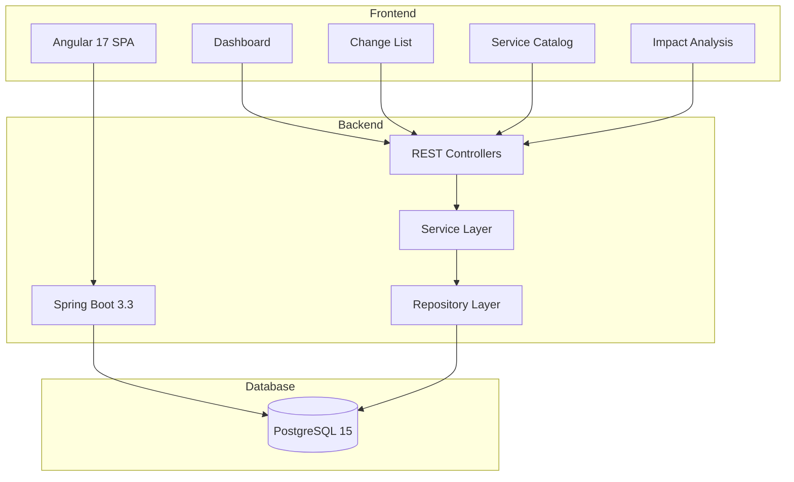

# Go-Live Management System

A production-ready full-stack application for managing change requests, service deployments, and dependency tracking with impact analysis capabilities.

## 🏗️ Architecture Overview



## ✨ Features

### UC1: View Go-Live Timeline by Day/Week
- **Day View**: See all change requests scheduled for a specific day with expandable deployment details
- **Week View**: Overview of all changes across a 7-day period with summary statistics
- Timeline ordering by `planned_start` time

### UC2: View Service Deployments
- Track all microservices, web apps, and mobile apps deployed within a time range
- Deployment status tracking (PENDING, IN_PROGRESS, SUCCESS, FAILED, ROLLED_BACK)
- Version and configuration tracking

### UC3: Service Catalog
- Complete list of all services grouped by system
- Filter by service type (MICROSERVICE, WEB, MOBILE_APP, BATCH)
- Tech stack, repository, and pipeline information

### UC4: Dependency Graph & Impact Analysis
- Interactive Cytoscape.js visualization of service dependencies
- **Upstream dependencies**: Services that a selected service depends on
- **Downstream dependencies**: Services that depend on the selected service
- **Cross-change risk**: Services affected by rollback that are NOT in the current change

### UC6: Create Go-Live Request
- Create change requests with multiple service deployments
- Associate with systems, set planned times, and track status
- Link to JIRA tickets and deployment pipelines

## 🛠️ Technology Stack

### Frontend
- **Framework**: Angular 17+ with Standalone Components
- **UI Library**: Angular Material
- **Charts**: ngx-charts
- **Graph Visualization**: Cytoscape.js
- **Language**: TypeScript
- **Build**: Angular CLI

### Backend
- **Framework**: Spring Boot 3.3+
- **Language**: Java 21
- **ORM**: Spring Data JPA
- **Query**: QueryDSL
- **Mapping**: MapStruct
- **Utilities**: Lombok
- **API Docs**: OpenAPI/Swagger
- **Migration**: Flyway

### Database
- **RDBMS**: PostgreSQL 15
- **Admin UI**: pgAdmin 4

### DevOps
- **Containerization**: Docker
- **Orchestration**: Docker Compose
- **Web Server**: Nginx (for frontend)

## 📋 Prerequisites

- **Docker**: 20.10+
- **Docker Compose**: 2.0+
- **Java**: 21 (for local development)
- **Node.js**: 20+ (for local development)
- **Maven**: 3.9+ (for local development)

## 🚀 Quick Start with Docker Compose

### 1. Clone the Repository
```bash
git clone <repository-url>
cd golive-management-system
```

### 2. Start All Services
```bash
docker-compose up -d
```

This will start:
- PostgreSQL on port **5432**
- pgAdmin on port **5050**
- Backend API on port **8080**
- Frontend UI on port **4200**

### 3. Access the Application

| Service | URL | Credentials |
|---------|-----|-------------|
| **Frontend** | http://localhost:4200 | N/A |
| **Backend API** | http://localhost:8080 | N/A |
| **Swagger UI** | http://localhost:8080/swagger-ui.html | N/A |
| **pgAdmin** | http://localhost:5050 | admin@golive.com / admin |
| **PostgreSQL** | localhost:5432 | golive / golive |

### 4. View Logs
```bash
# All services
docker-compose logs -f

# Specific service
docker-compose logs -f backend
docker-compose logs -f frontend
```

### 5. Stop Services
```bash
docker-compose down

# Remove volumes (WARNING: deletes all data)
docker-compose down -v
```

## 🔧 Local Development Setup

### Backend Development

```bash
cd backend

# Build the project
mvn clean package

# Run locally (requires PostgreSQL running)
mvn spring-boot:run

# Run with Docker profile
mvn spring-boot:run -Dspring-boot.run.profiles=docker
```

**Backend runs on**: http://localhost:8080

**API Documentation**: http://localhost:8080/swagger-ui.html

### Frontend Development

```bash
cd frontend

# Install dependencies
npm install

# Start development server
npm start

# Build for production
npm run build
```

**Frontend runs on**: http://localhost:4200

## 📊 Database Schema

### Tables

1. **system**: Application/system groupings
2. **service**: Microservices, web apps, mobile apps, batch jobs
3. **service_dependency**: Service-to-service dependencies
4. **change_request**: Go-live change requests
5. **change_service_deployment**: Service deployments within changes

### Migrations

Flyway migrations are located in `backend/src/main/resources/db/migration/`:
- `V1__initial_schema.sql`: Core schema
- `V2__sample_data.sql`: Sample data for testing

Migrations run automatically on application startup.

## 🌐 API Endpoints

### Change Management
```
POST   /api/changes                    # Create change request
GET    /api/changes                    # List all changes (with filters)
GET    /api/changes/{id}               # Get change by ID
GET    /api/changes/{id}/services      # Get change deployments
GET    /api/changes/{id}/impact        # Get impact analysis
```

### Service Catalog
```
GET    /api/services                   # List all services (with filters)
GET    /api/services/{id}              # Get service by ID
GET    /api/services/{id}/dependencies # Get service dependencies
```

### Dashboard
```
GET    /api/dashboard/day              # Day view (?date=2025-12-10)
GET    /api/dashboard/week             # Week view (?start=2025-12-09)
GET    /api/dashboard/services-deployed # Deployed services (?from=...&to=...)
```

### Query Parameters

**Change Filters**:
- `from`: Start date-time (ISO 8601)
- `to`: End date-time (ISO 8601)
- `system`: System ID
- `status`: DRAFT, APPROVED, IN_PROGRESS, COMPLETED, CANCELLED, ROLLED_BACK

**Service Filters**:
- `system`: System ID
- `type`: MICROSERVICE, WEB, MOBILE_APP, BATCH

## 📁 Project Structure

```
golive-management-system/
├── backend/
│   ├── src/main/
│   │   ├── java/com/company/golive/
│   │   │   ├── config/          # Spring configuration
│   │   │   ├── controller/      # REST controllers
│   │   │   ├── domain/          # JPA entities
│   │   │   ├── dto/             # Data transfer objects
│   │   │   ├── mapper/          # MapStruct mappers
│   │   │   ├── repository/      # Spring Data repositories
│   │   │   └── service/         # Business logic
│   │   └── resources/
│   │       ├── db/migration/    # Flyway migrations
│   │       ├── application.yml
│   │       └── application-docker.yml
│   ├── Dockerfile
│   └── pom.xml
├── frontend/
│   ├── src/
│   │   ├── app/
│   │   │   ├── components/      # Angular components
│   │   │   ├── models/          # TypeScript interfaces
│   │   │   ├── services/        # API services
│   │   │   ├── app.component.ts
│   │   │   ├── app.config.ts
│   │   │   └── app.routes.ts
│   │   ├── environments/        # Environment configs
│   │   ├── index.html
│   │   ├── main.ts
│   │   └── styles.scss
│   ├── Dockerfile
│   ├── nginx.conf
│   ├── angular.json
│   ├── package.json
│   └── tsconfig.json
├── docker-compose.yml
└── README.md
```

## 🔍 Sample Data

The application includes sample data with:
- 4 systems (E-Commerce, Payment, Customer, Analytics)
- 14 services across different types
- Service dependencies forming a realistic microservices architecture
- 5 change requests with various statuses
- Multiple service deployments

## 🐛 Troubleshooting

### Backend won't start
```bash
# Check if PostgreSQL is ready
docker-compose logs postgres

# Restart backend
docker-compose restart backend
```

### Frontend can't connect to backend
- Ensure backend is running: `curl http://localhost:8080/api/services`
- Check CORS configuration in `backend/src/main/java/com/company/golive/config/WebConfig.java`
- Verify environment configuration in `frontend/src/environments/environment.ts`

### Database connection issues
```bash
# Check PostgreSQL logs
docker-compose logs postgres

# Connect to database
docker-compose exec postgres psql -U golive -d golive

# List tables
\dt
```

### Port conflicts
If ports 4200, 5050, 5432, or 8080 are already in use:
1. Stop conflicting services
2. Or modify ports in `docker-compose.yml`

## 🧪 Testing

### Backend Tests
```bash
cd backend
mvn test
```

### Frontend Tests
```bash
cd frontend
npm test
```

## 📈 Performance Considerations

- **Database Indexing**: All foreign keys and frequently queried columns are indexed
- **Connection Pooling**: HikariCP with optimized pool settings
- **Lazy Loading**: Angular routes use lazy loading for optimal bundle size
- **Caching**: Nginx caches static assets with appropriate headers
- **Compression**: Gzip enabled for all text-based responses

## 🔒 Security Notes

For production deployment:
1. Change default passwords in `docker-compose.yml`
2. Use environment variables for sensitive data
3. Enable HTTPS with proper certificates
4. Configure proper CORS origins
5. Add authentication/authorization
6. Use secrets management (e.g., HashiCorp Vault)

## 📝 License

[Your License Here]

## 👥 Contributors

[Your Team Here]

## 📞 Support

For issues and questions, please open an issue in the repository.
